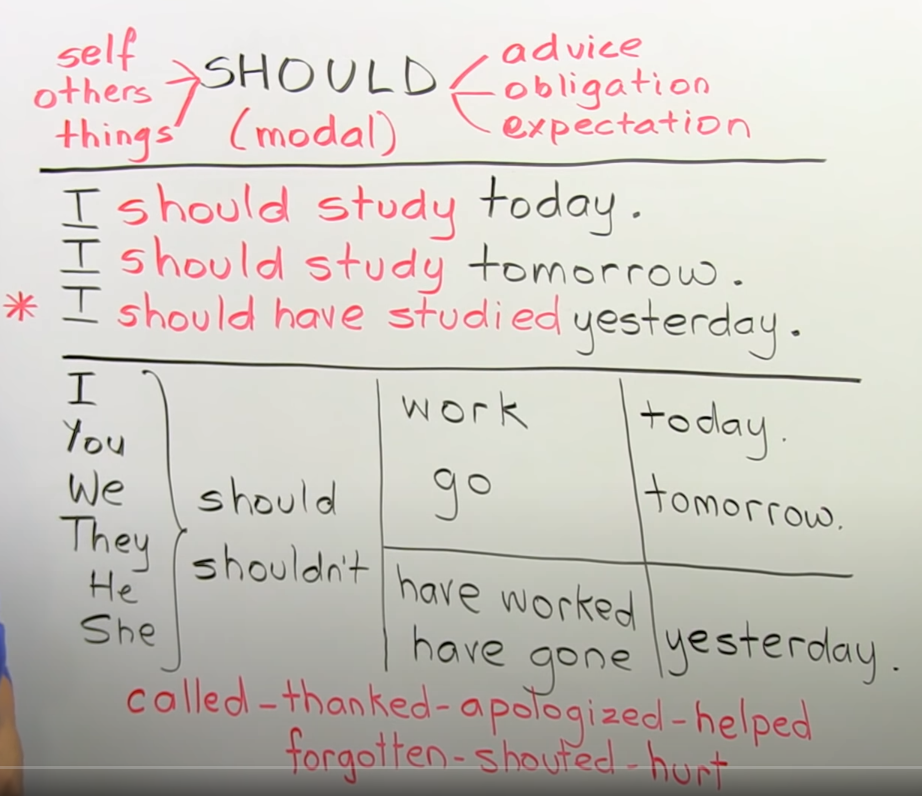
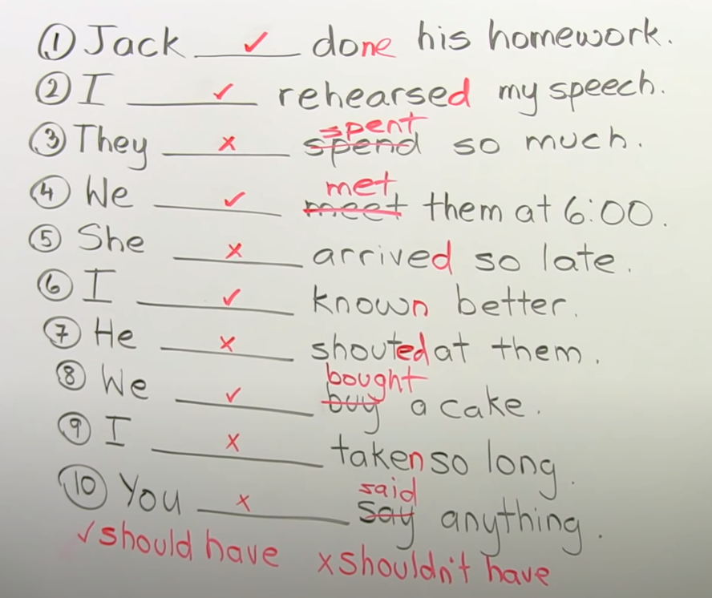
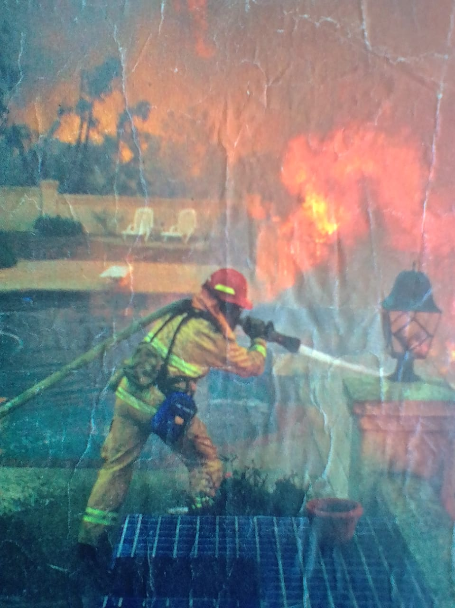
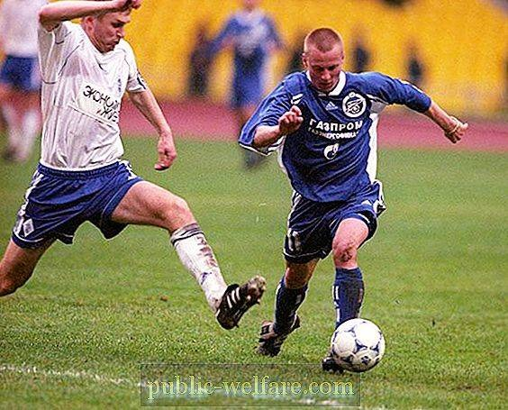
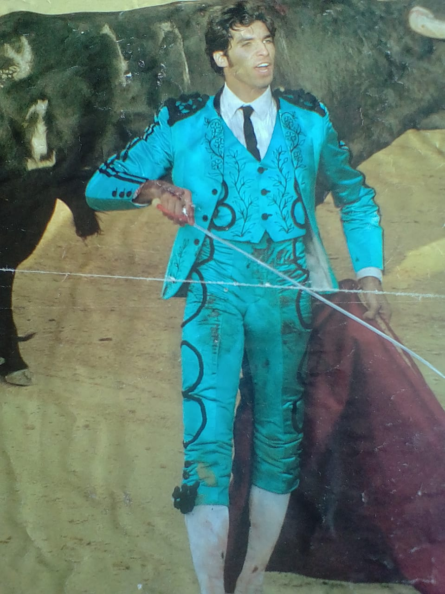

# Significados
- Guess their meanings Adivina su Significado
- Wrong Incorrecto

# 8A

# 8B 

i will greet them   los saludaré

Diferences between zero condition and frist condiciont

when use zero condition , is a fact **sucedera**

Si tu dejas la leche a fuera se agriara

When use first condition, is a posibility **puede suceder**

si tu no estudias puedes que repruebes matematicas

also is when its no general in the planet

---

# 8A 

something else Algo más
there´s hardly any diference  apenas hay diferencia
little bit un poco
this one        éste
checkmark       marca de verificación (palomitas)

she should have gone out yesterday

when you use should in past, is necessary  use verb in **third form** 

## Apuntes should

## Homework

-  Make 10 sentences about the pictures
{width=250px}

{width=100px}

{width=100px}

{width=100px}

{width=100px}

the doctor should  spleep more
the  bullfighter should change the profesion
the doctor shouldn´t have arrived so late
the  waitress shouldn´t  have spleep in the work
the firefighter shouldn´t enter in house on fire